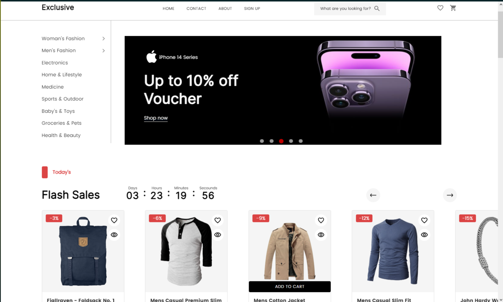
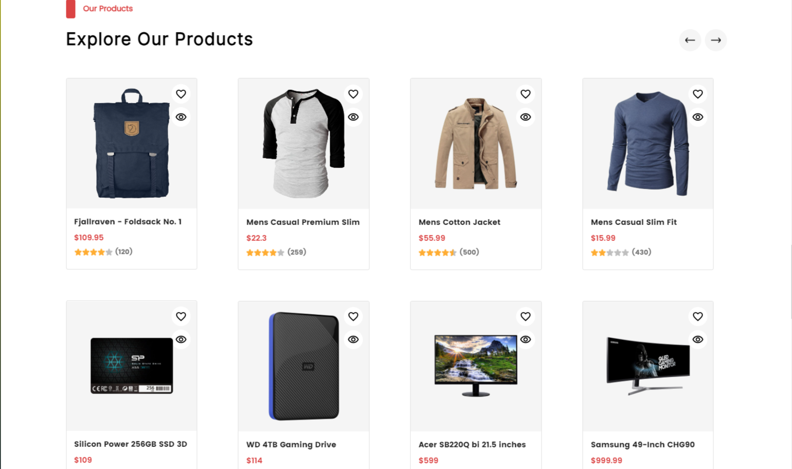
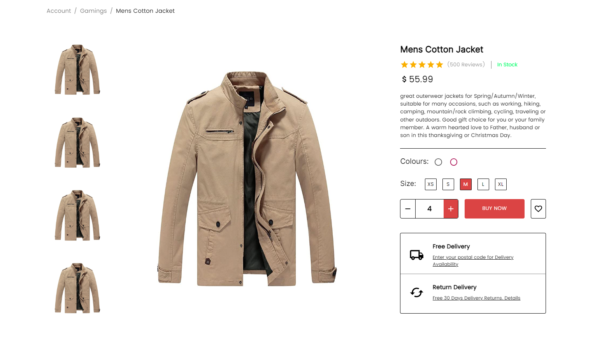

# E-commerce


This is a collaborative React project that we built for training, where we converted E-commerce Figma website designs into Reactjs components using Material UI. Our team consisted of four members who worked to develop the app.

## Prerequisites
HTML

CSS

Java Script/Reactjs Basics

Git & github
## Installation

1.Clone the repo

```bash
  git clone https://github.com/ahmedsaleh10/E-commerce.git
```
2.Install NPM packages
```bash
  npm install
```

## Usage/Examples
1.Start the development server

## Photos
### Home Page


### Home Page


### Product Page

```javascript
npm start

```
2.Open your browser and go to http://localhost:3000 to see the app running.


## Deployment

This app can be deployed on various hosting platforms like Heroku, Netlify, or Firebase. You can use this link:

## Collaborators
-Ahmad Saleh (GitHub username:ahmedsaleh10)

-Marwa Salah (GitHub username: Marwahaifawi)

-Maher Nahle(GitHub username: Maher-N)

-Sondos Naalwi (GitHub username: SondosNaalwi)
## Technologies Used
React

Material UI

Figma

Git

GitHub
## Acknowledgements

We would like to thank Gaza Sky Geeks for giving us the opportunity to work on this project. We would also like to thank the Material UI team for providing such a great library of components and styles that made our work easier and more efficient.

## Benefits of Collaborating on a React Project as a Team
Working on a collaborative React project as a team can lead to increased knowledge, efficiency, communication, learning opportunities, and accountability. These benefits can help to make the project more successful and enjoyable for everyone involved.
